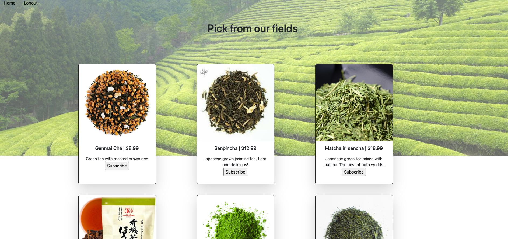
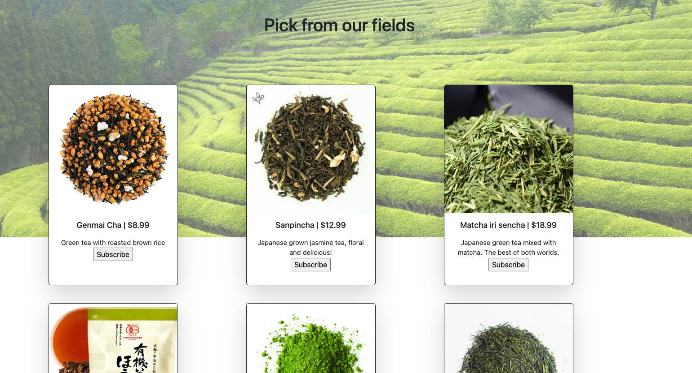
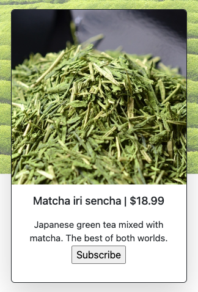
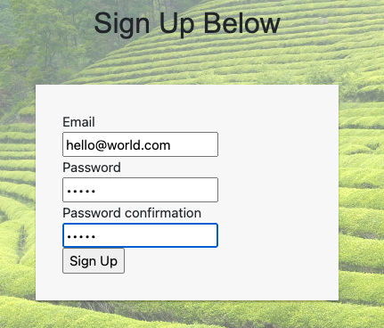
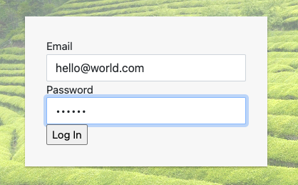
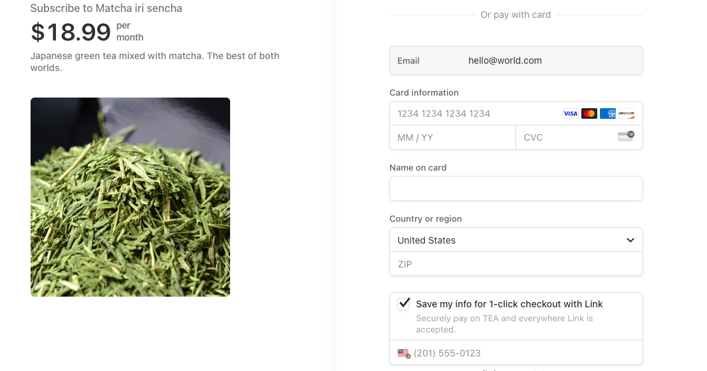
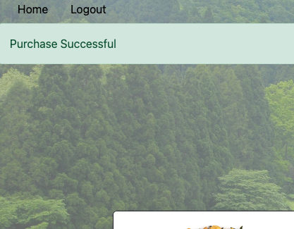

<h1 align="center">Tea Time</h1>

Tea time is a web store application where users can buy monthly subscriptions to their favorite teas.
Tea time was originally an api that was created during my time at [Turing School of Software and Design's](https://turing.edu/) backend engineering program. 
Tea Time is now converted to a monolith Ruby on Rails application with a [Stripe](https://stripe.com/?utm_campaign=paid_brand-US_Search_Brand_Stripe_Control-20047966507&utm_medium=cpc&utm_source=google&ad_content=656551963827&utm_term=stripe&utm_matchtype=e&utm_adposition=&utm_device=c&gclid=CjwKCAjwq4imBhBQEiwA9Nx1BsXHpqz8y7v2Er9TTUEDTh2-S3cI86S7QXrWnM1f0Ojq83MILXwwZxoCAyUQAvD_BwE) credit card payment integration and styled with bootstrap. 

A store owner can add and remove products from the Stripe dashboard making the products(tea) information on Tea Time dynamic.

The learning objectives for this project:
<ul>
  <li>Create appealing views that are user friendly</li>
  <li>Integrate with Stripe for an easy checkout experience</li>
  <li>Create user authentication with login feature</li>
</ul>

Current functionality 
<ol>
  <li>login</li>
  <li>logout</li>
  <li>Create an account</li>
  <li>View teas within the homepage</li>
  <li>Purchase products/checkout with a credit card</li>
</ol>

Possible next steps:
<ul>
  <li>A thank you page</li>
  <li>Store more user data(Address, past purchases)</li>
  <li>Create a cart that all items can be saved to</li>
  <li>A user can checkout with more than one item in their cart</li>
  <li>Admin Features such as checking invoices, viewing cancelled orders etc.</li>
</ul>

 

# Table of Contents
- [Flow of Application](#app-flow)
- [Tech & Tools Used](#tech-and-tools)
- [Contributors](#contributors)

# Tech and Tools

  #### Built With
  -  **2.7.4**
  -  **5.2.8.1**
  - 
  -  **3.12.0**
  - 

#### Gems Used:
  - [Stripe](https://github.com/stripe/stripe-ruby)
  - [Bootstrap](https://github.com/twbs/bootstrap) 
  - [BCrypt](https://github.com/bcrypt-ruby/bcrypt-ruby)
  - [Capybara](https://github.com/teamcapybara/capybara)
  - [Launchy](https://github.com/copiousfreetime/launchy)
  - [RSpec](https://github.com/rspec/rspec-metagem)
  - [Shoulda Matchers](https://github.com/thoughtbot/shoulda-matchers)
  - [Pry](https://github.com/pry/pry-rails)

  # App flow
  <li>Home page</li> 
  
     
  <li>Choose a tea and click subscribe</li> 
   
      
   <li>Sign up - users must be signed up to be able to subscribe. Will route to login page.</li> 
   
      
   <li>Login - will route to homepage and user can click subscribe for the tea of their choice</li> 
   
      
   <li>Pay with card - After payment will route to the home page</li> 
   
      
   <li>Success!!</li> 
   
     

  # Contributors

  <table>
  <tr>
    <td></td>
  </tr>
  <tr>
    <td><strong>Yuji Kosakowski</strong></td>
  </tr>
  <tr>
    <td>
      
<a href="https://github.com/Yuji3000">GitHub</a> 
      <a href="https://www.linkedin.com/in/yujikosa/">LinkedIn</a>

    </td>
  </tr>
</table>

