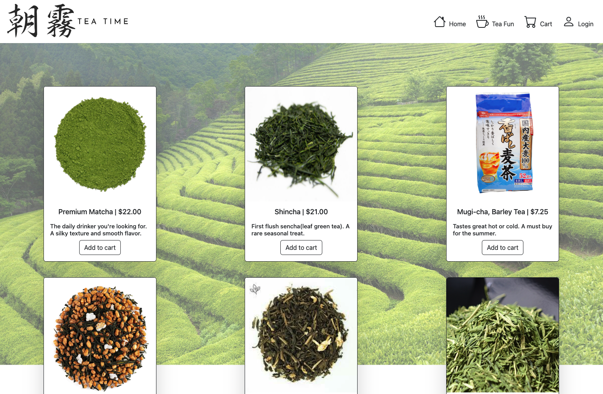

<h1 align="center">Tea Time</h1>
<div align="center"></div>

Tea time is a web store application where users can buy monthly subscriptions to their favorite teas.
Tea Time is a monolith Ruby on Rails application with a [Stripe](https://stripe.com/?utm_campaign=paid_brand-US_Search_Brand_Stripe_Control-20047966507&utm_medium=cpc&utm_source=google&ad_content=656551963827&utm_term=stripe&utm_matchtype=e&utm_adposition=&utm_device=c&gclid=CjwKCAjwq4imBhBQEiwA9Nx1BsXHpqz8y7v2Er9TTUEDTh2-S3cI86S7QXrWnM1f0Ojq83MILXwwZxoCAyUQAvD_BwE) credit card payment integration, styled with bootstrap. Products can be stored via Stripe's dashboard, making the tea's rendered to the homepage view dynamic. Products are seeded by Stripe API. 


*** Tea Time was previously deployed to Render and taken down Feb 27, 2024 due to cost. ***

* Use the below information for logging in and payment
```
Email: test@test.com
Password: 123

When checking out via Stripe:
* Fill out all form fields
* Fake Credit Card info is expected! Please make it realistic. Example credit card expiration date must be valid

Credit Card #: 4242 4242 4242 4242

```


The learning objectives for this project:
<ul>
  <li>Create the best user experience by displaying appealing views that are user friendly</li>
  <li>Integrate with Stripe for an easy checkout experience</li>
  <li>Create user authentication with login feature</li>
</ul>

Current functionality 
<ol>
  <li>login</li>
  <li>logout</li>
  <li>Create an account</li>
  <li>View teas within the homepage</li>
  <li>Purchase products/checkout with a credit card</li>
  <li>Has a cart that all items can be saved to</li>
  <li>A user can checkout with more than one item in their cart</li>
</ol>

Possible next steps:
[Project Board](https://github.com/users/Yuji3000/projects/7/views/1)

<br>

# Table of Contents
- [Flow of Application](#app-flow)
- [Tech & Tools Used](#tech-and-tools)
- [Contributors](#contributors)

# Tech and Tools

  #### Built With
  -  **2.7.4**
  -  **5.2.8.1**
  - 
  - 
  - 
  - 
  -  **3.12.0**
  - 


#### Gems Used:
  - [Stripe](https://github.com/stripe/stripe-ruby)
  - [Bootstrap](https://github.com/twbs/bootstrap) 
  - [BCrypt](https://github.com/bcrypt-ruby/bcrypt-ruby)
  - [Capybara](https://github.com/teamcapybara/capybara)
  - [Launchy](https://github.com/copiousfreetime/launchy)
  - [RSpec](https://github.com/rspec/rspec-metagem)
  - [Shoulda Matchers](https://github.com/thoughtbot/shoulda-matchers)
  - [Pry](https://github.com/pry/pry-rails)
  - [Figaro](https://github.com/laserlemon/figaro)

# App flow
  Nov 10, 2023


https://github.com/Yuji3000/tea_monolith/assets/108035840/d8383e0f-2fbd-4cd6-86ad-cd339cfb68e7


  # Contributors

  <table>
  <tr>
    <td></td>
  </tr>
  <tr>
    <td><strong>Yuji Kosakowski</strong></td>
  </tr>
  <tr>
    <td>
      <div align="center"><a href="https://github.com/Yuji3000">GitHub</a><br>
      <a href="https://www.linkedin.com/in/yujikosa/">LinkedIn</a></div>
    </td>
  </tr>
</table>
